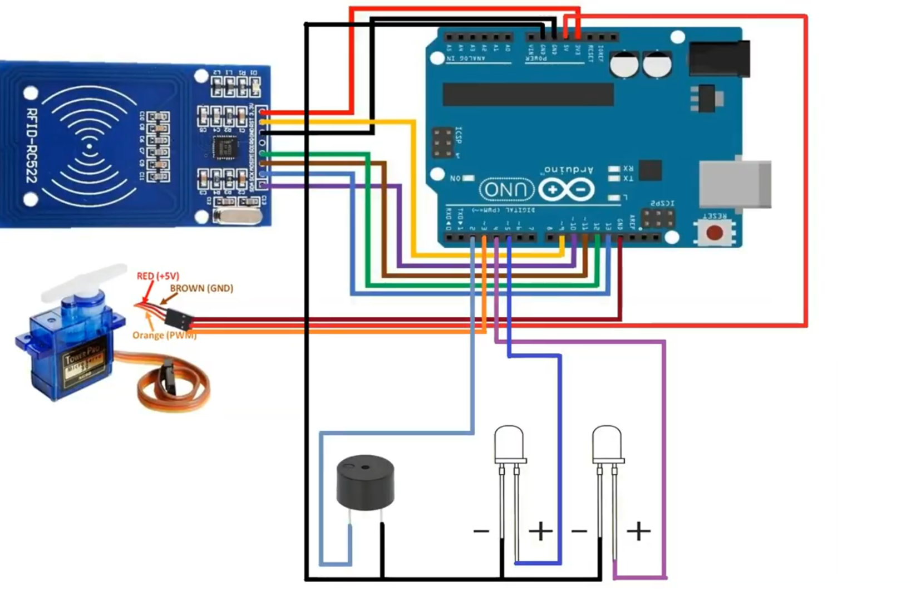

# Smart-security-door
Our project's goal is to create an automated door lock which allows you to unlock it through face recognition. If the face recognition is successful the door lock will unlock otherwise it will remain locked. The project is all local based but it can be hosted to diferent machines if it's altered correctly. 

## Requirements:
 - # Hardware
   -  Breadboard
   -  Wires
   -  RC522 RFID Sensor and RFID cards
   -  Micro Servo 
   -  LEDs 
   -  Buzzer
   -  Laptop/PC or Raspberry Pi
 
 - # Software
   -  MongoDB
   -  Python with opencv, opencv-contrib-python, mediapipe, os, numpy, pymongo, serial, uvicorn
   -  Node.js with Reactjs, axios,  material-table
   -  Android studio
   
## What the project is using
 - For the arduino code the device must have the <a href="https://www.arduino.cc/en/software">Arduino IDE</a> so the use can install the code to the arduino.
 - For the face recognition part of the project, we will need <a href="https://www.python.org/">python</a>.
 - The main libraries for the face recognition are <a href="https://opencv.org/">OpenCV</a> and <a href="https://google.github.io/mediapipe/">Mediapipe</a>.
   -  OpenCv will be used for the camera handling and the trainning of the algorithm.
   -  Mediapipe will be used for the better tracking of the face.
 - It is necessary to have an arduino and  
 - The project has a backend part for handling the data.
   - It uses a multithreading server where all the data are send. The server is made with python and is a TCP socket server.
   - The server is saving the data to a <a href="https://www.mongodb.com/">MongoDB</a> database.
   - The project uses the <a href="https://fastapi.tiangolo.com/">fastapi</a> python library for making the <a href="https://www.redhat.com/en/topics/api/what-is-a-rest-api#:~:text=A%20REST%20API%20(also%20known,by%20computer%20scientist%20Roy%20Fielding.">API</a> part of the project.
   - Also it uses <a href="https://www.uvicorn.org/">uvicorn</a> to create a WebClient.
 - The frontend of the project uses <a href="https://nodejs.org/">NodeJS</a>. Specifically <a href="https://reactjs.org/">React</a>
 - Also there is as simple android app the displays the data from the api WebClient
   - To use the app the project needs <a href="https://www.mongodb.com/">Android Studio</a>
 
## Installation:
# The Software part
 First install python on your device [<a href="https://www.python.org/downloads/">Download</a>]. After that, run the following command in to a terminal<br />
  -```python3 -m pip install -r requirements.txt```.<br />
 Then for the frontend part install NodeJS [<a href="https://nodejs.org/en/download/">Download</a>] and un the following commands in to a terminal: <br />
   ```npm axios bootstrap``` more about axios <a href="https://www.npmjs.com/package/axios">here</a>, more about bootstrap <a href="https://getbootstrap.com/">here</a><br />
   ```bash 
   npm install material-table --save
   npm install @material-ui/core --save
   ```
 Lastly, download Android Studio [<a href="https://developer.android.com/studio?gclid=Cj0KCQiA9OiPBhCOARIsAI0y71DaIBNJtUiDsKBke08osAMGXi8kei2DlyRLMzUNe1EAWD54G80AkswaAuqrEALw_wcB&gclsrc=aw.ds#downloads">Download</a>]
 
# The Hardware part
 For the hardware part you will need the items in the [list](#Hardware) to create the following
 
 <a href="https://www.youtube.com/watch?v=wHEwZ1uJExM">Tutorial</a> on how to build it and how it works.

## How to start:
You will first need to run the faces.py file and capture two faces. Then you have to run the Server.py and after the the face_recognition.py.
For the backend WebClient, run in the folder the file in in the following command:<br />
```uvicorn WebClient:app --reload```<br />
The WebClient must be running for the rest to work
For the frontend, run in the folder the file in in the following command:<br />
```npm start```<br />
For the app start the emulator in ardroid studio
